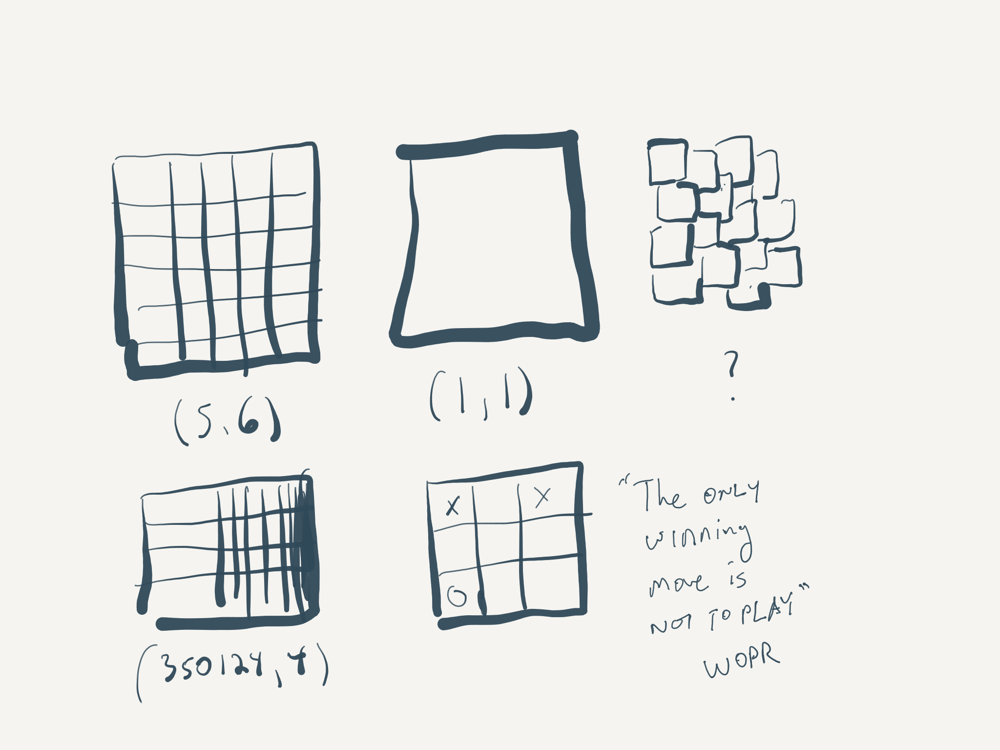
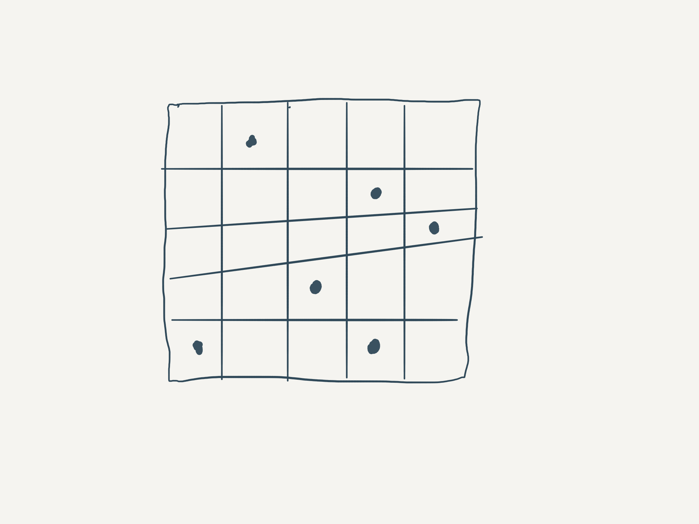
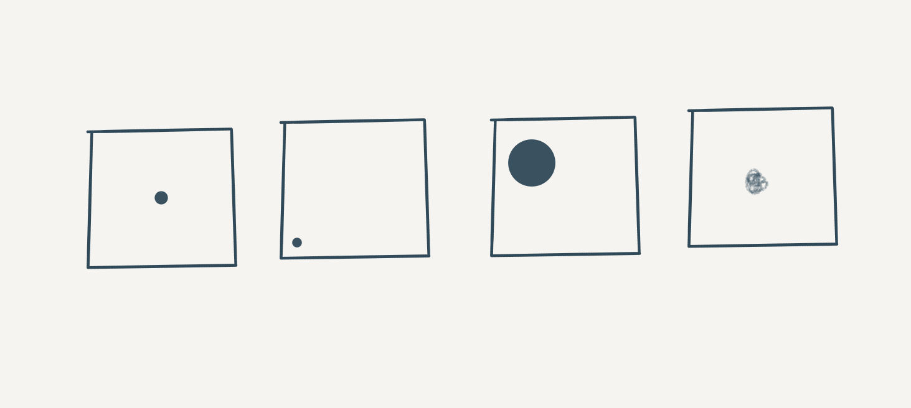

# I-AM

I-AM is a two-dimensional programming language inspired by [Befunge](https://esolangs.org/wiki/Befunge) and the author's insomnia caused by a looming sense of dread and [existential questioning](https://davidnunez.com/the-global-derealization).

This language for programmers to investigate whether or not they and everything they know in their World are real.

## The World

The I-AM computational space is called the World. The World is specified to be a two-dimensional grid of arbitrary dimensions. 

The Grid does not need to be regular to be considered a valid World. 

The x and y dimensions of the Grid might hold arbitrary meaning. Most of the time, they are meaningless. People fight about them, anyway.

Here is an illustration of some valid Worlds.

## Commands

I-AM has a single command:

`.`  - Output "Hello World" 

A programmer can place this command in any grid cell in the World. 

The command glyph may appear anywhere inside a grid cell, but it must always stay inside of its confines. The command will stare at its walls dreaming of jumping into an adjacent cell. Do not permit this under any circumstance, or the program will instantly halt.

It is unknown what happens when two or more commands exist in a single cell.

**The output phrase "Hello World" is essential to I-AM and may not be substituted with other thoughts. Placing this command in the World is the act of a programmer desperately screaming into the World that they exist.**

## Programs

An I-AM program is a World littered with output commands. 

A pointer begins at any location on the Grid and begins scanning the Grid in arbitrary directions. Whenever the pointer encounters a `.` the computer should execute the output command.

Because the author has a Western bias, the default begins with the pointer at the upper left of the World, scanning from left to right. When the pointer reaches the edge of the World, which is flat, it may either fall off (i.e., halt the program) or, for some reason, restart at the leftmost cell in the following row in the Grid.

It is unspecified what happens if the World rotates. For ease of specification, the author assumes the World is stable and unmoving, despite that it is hurtling through time and space.

## Implementation

There are currently no known interpreters for I-AM. There might also be an infinite number of interpreters.

It is permissible for the output to render "Hello World" in any language of the programmers choosing, including other programming languages. 

Most programs will render "Hello World" on the cold sadness of computer screens, but other output modes are possible. 

For example, an interpreter could be written for I-AM where the programmer lays on their back on top of a Mayan temple at 2:00 AM while staring into the incomputable, heartbreaking density of the Milky Way. 

Raised among city lights, the programmer has never seen the night sky in its full resolution. The scale of it all induces a sense of reverse vertigo in the programmer. They dig their fingers into the stones by their sides, lest they fly up forever into the spinning void. 

At this moment, as the edges of space and earth intermingle in the programmer's mind, the programmer will scream out "Hello World" at the heavens. The universe will not shout back. 

The programmer is drenched in their sweat. Indeed, the early morning hours are no respite for the Belizian humidity. The programmer calls out again, "Hello World." 

The jungle has never been as still. Then a single shooting star rips across space. 

It is then that the programmer will finally know. 

They begin to cry.

## Computational Class

The author believes it is unlikely that I-AM can be Turing-complete because there are too many unresolvable questions in the World. 

It must first be shown, definitively, that Alan Turing ever existed and that the notion of Turing-complete exists. Second, it must be shown that I-AM exists and could possibly have existed during Alan Turing's lifetime. Furthermore, for someone to write a proof that this language is Turing complete, that person would first need to demonstrate that they exist. Proving one's existence requires I-AM. Therefore, the proof quickly becomes tautological. 

It is, however, absolutely known that all I-AM programs halt after a certain time. Indeed, this may contribute to a proof that Turing did not exist. 

When an I-AM program halts, sometimes people get sad. They eventually heal. They eventually move on. That's what people do. 

Nobody really understands why I-AM programs halt. It seems random and senseless. Some people think it's cruel and get angry at the World. 

Some people think that the programs simply begin running in a different computational space. 

Maybe the fact that I-AM programs always halt is enough of a proof to know that they exist.

## Examples

Here is an I-AM program  that may or may not prove the programmer exists.

These are four I-AM programs that are computationally equivalent. The author believes you would agree that these four programs are anything but equivalent.

## Caution about the Null Hypothesis

Note that if a programmer successfully authors a program that successfully runs on a World of dimensions (0,0),  it is likely they have achieved a singularity where they have written all of the programs and none of the programs at once. 

Thus, it is an open question if the creator of such a program will continue to exist or if they ever existed at all.

---

I-AM was invented by [David Nuñez](https://davidnunez.com) during his morning coffee on 2020-08-10.